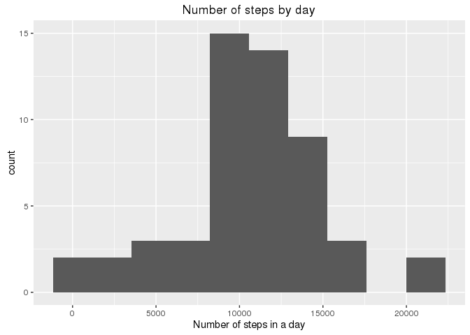
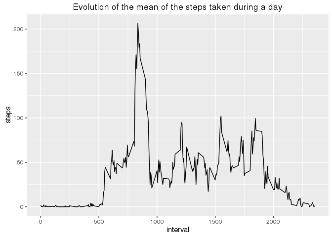
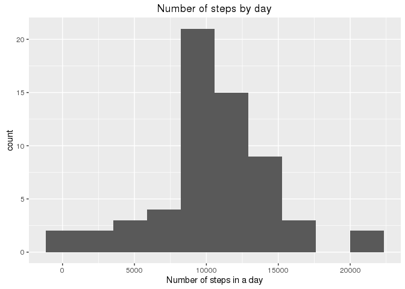
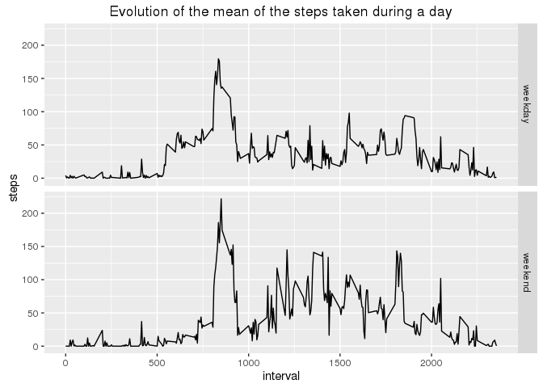

# Reproducible Research: Peer Assessment 1

### Used Libraries

```r
library(ggplot2)
library(mice)
```

```
## Loading required package: Rcpp
```

```
## mice 2.25 2015-11-09
```

```r
library(lubridate)
```

```
## 
## Attaching package: 'lubridate'
```

```
## The following object is masked from 'package:base':
## 
##     date
```

## Loading and preprocessing the data

```r
unzip('activity.zip')
activity <- read.csv2('activity.csv', sep = ',')
```


## What is mean total number of steps taken per day?

```r
stepsByDay <- aggregate(steps ~ date, activity, sum)
```

A histogram showing the number of occurence of the quantities of steps taken in
a day.


```r
ggplot(stepsByDay) +
  geom_histogram(aes(x = steps), bins = 10) +
  ggtitle("Number of steps by day") + 
  xlab("Number of steps in a day")
```

<!-- -->
  
Calculation of the mean and median of steps taken by day

```r
meanSteps <- as.integer(mean(stepsByDay[[2]], na.rm = T))
medianSteps <- median(stepsByDay[[2]], na.rm = T)
```
The mean number of steps taken is 10766 
and the median is 10765

## What is the average daily activity pattern?

```r
stepsByInterval <- aggregate(steps ~ interval, activity, mean)
```

A graphic showing the evolution of the mean of the steps taken during a day


```r
ggplot(stepsByInterval) +
  geom_line(aes(x = interval, y = steps)) +
  ggtitle('Evolution of the mean of the steps taken during a day')
```

<!-- -->
  
The interval 835
shows the most steps taken during a day in average namely 
206.1698113

## Imputing missing values

The activity dataset contains 2304 missing values.
Let's replace those using MICE method and create a new dataset without NA.

```r
micedActivity <- mice(activity, method = 'pmm')
```

```
## 
##  iter imp variable
##   1   1  steps
##   1   2  steps
##   1   3  steps
##   1   4  steps
##   1   5  steps
##   2   1  steps
##   2   2  steps
##   2   3  steps
##   2   4  steps
##   2   5  steps
##   3   1  steps
##   3   2  steps
##   3   3  steps
##   3   4  steps
##   3   5  steps
##   4   1  steps
##   4   2  steps
##   4   3  steps
##   4   4  steps
##   4   5  steps
##   5   1  steps
##   5   2  steps
##   5   3  steps
##   5   4  steps
##   5   5  steps
```

```r
completedActivity <- complete(micedActivity,1)
completedStepsByDay <- aggregate(steps ~ date, completedActivity, sum)
```

A histogram showing the number of occurence of the quantities of steps taken in
a day. Here the missing values have been inputed using MICE method.


```r
ggplot(completedStepsByDay) +
  geom_histogram(aes(x = steps), bins = 10) +
  ggtitle("Number of steps by day") + 
  xlab("Number of steps in a day")
```

<!-- -->
  
Calculation of the mean and median of steps taken by day with inputed missing
values.

```r
completedMeanSteps <- as.integer(mean(completedStepsByDay[[2]]))
completedMedianSteps <- median(completedStepsByDay[[2]])
```

The mean number of steps taken is 10540 
and the median is 10439.
As the method used implies some randomness on those 2 results, the exact change
made by inputing missing values is not really predictible. However it is fairly
safe to say that both value will change. The amount of the change will however
be different each time this analysis is run.  
One thing for sure, the total daily number of steps will be higher as we only
added steps in the data by inputing missing values.

## Are there differences in activity patterns between weekdays and weekends?
Updating the completed dataset with a new variable showing if the date is a
weekday or a weekend.


```r
completedActivity["weekday"] <- ifelse(
  wday(as.Date(completedActivity$date)) < 6,
  "weekday",
  "weekend")
weekStepsByInterval <- 
  aggregate(steps ~ interval + weekday, completedActivity, mean)
```
Now let's plot the activity for weekdays and weekend


```r
ggplot(weekStepsByInterval) +
  geom_line(aes(x = interval, y = steps)) +
  facet_grid(weekday ~ .) +
  ggtitle('Evolution of the mean of the steps taken during a day')
```

<!-- -->


